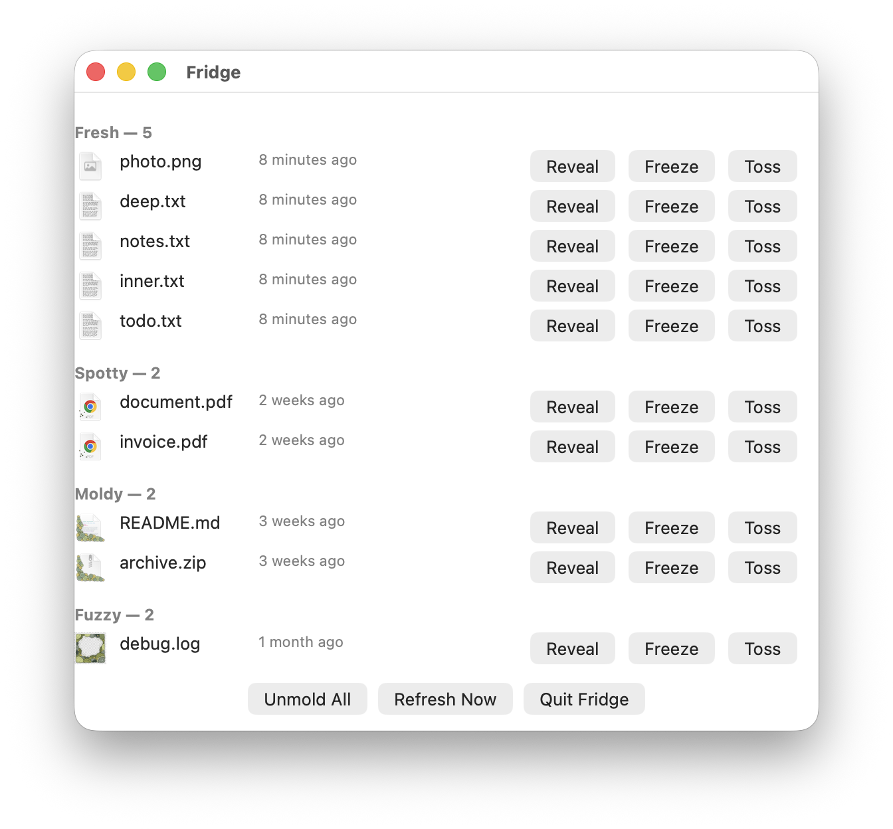
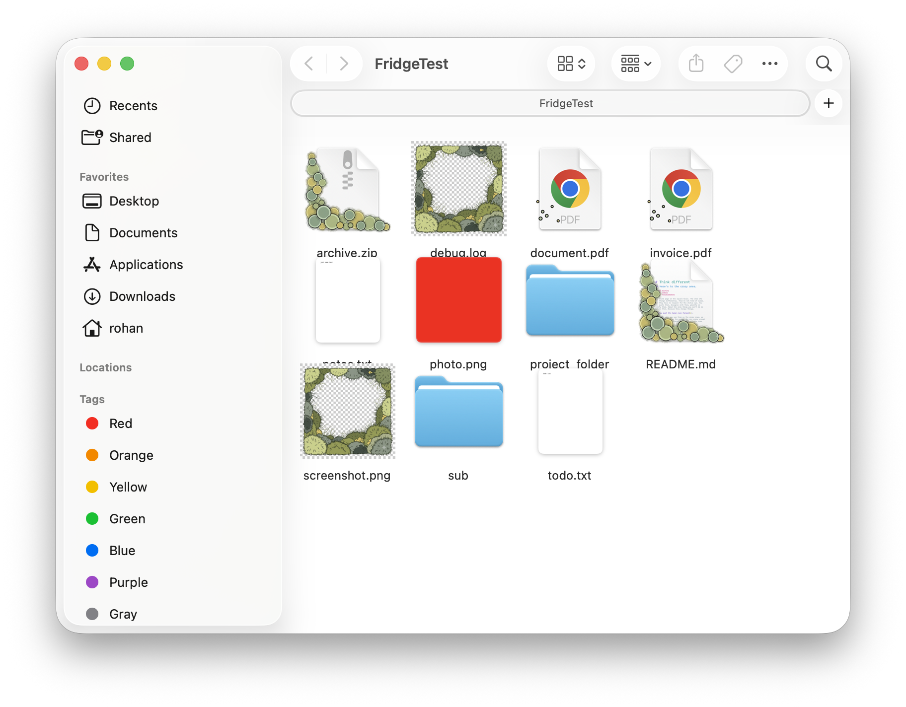

# Fridge

A macOS app for Downloads and Desktop. Files you don't touch grow mold on
their icons — right on the icon, in Finder, not a notification. The longer
a file sits untouched, the worse it looks, in four stages from fresh to
fuzzy. You clean up because it's gross, not because something nagged you.

Open the window to see every tracked file grouped into shelves — fresh on
top, rotting toward the bottom — with each file's real current icon, how
long since it was last opened, and buttons to reveal it in Finder, freeze
it so it never rots, or toss it to the Trash.



The mold is a real custom icon, written straight to the file — this is the
same folder in Finder, not a mockup:



## Status

Built and verified on a real Mac. Every claim below has been exercised and
confirmed working, not assumed. See `UNCERTAINTIES.md` for the full list of
originally-blind assumptions and what was actually found when each was
checked, and `DECISIONS.md` for one significant design change made after
testing (the UI was originally a menu bar icon; it's a window now).

## Building it

Open `Fridge.xcodeproj` in Xcode and build (⌘B), or from the command line:

```
xcodebuild -scheme Fridge -configuration Debug build
```

No signing certificate is required — it builds and runs ad-hoc signed.

## Full Disk Access

Painting a moldy icon onto a file means writing to that file, which macOS
only allows with Full Disk Access — and it won't prompt for it on its own.
On first launch, Fridge actually attempts the operation (writes a custom
icon to a throwaway file in Desktop and checks whether it really worked,
rather than guessing from some other file's permissions) and, if it
failed, shows its own panel with a button that opens straight to
System Settings > Privacy & Security > Full Disk Access. Grant it there.

Because the app is ad-hoc signed, Xcode assigns it a new signature on
every rebuild, and macOS ties the Full Disk Access grant to that exact
signature — so this grant will need to be re-added after each rebuild
during development. That's expected, not a bug.

## If something goes wrong: Unmold All

Click **Unmold All** at the bottom of the window. It strips the custom
icon from every file Fridge knows about, restoring each one's original
icon exactly — confirmed byte-for-byte identical to the original in
testing. This is the emergency undo.

## What's tracked right now

The Watcher is currently pointed at `~/FridgeTest`, a junk folder used for
development, not the real Downloads/Desktop. Switching it to the real
folders is the last step before shipping, done as its own single-line
commit specifically so it's trivial to revert.
