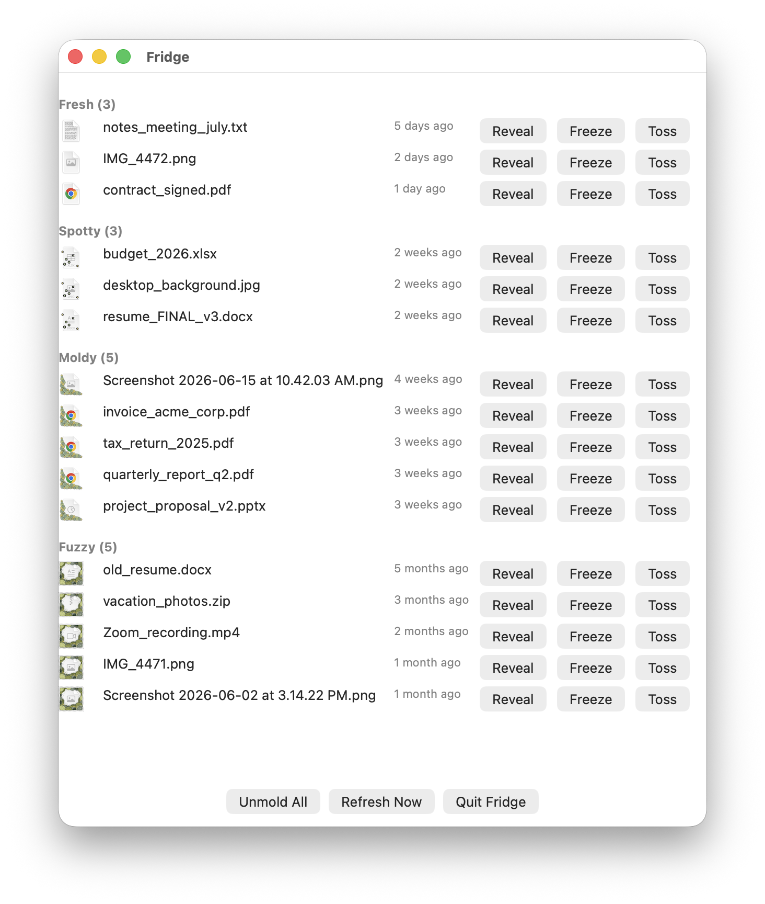
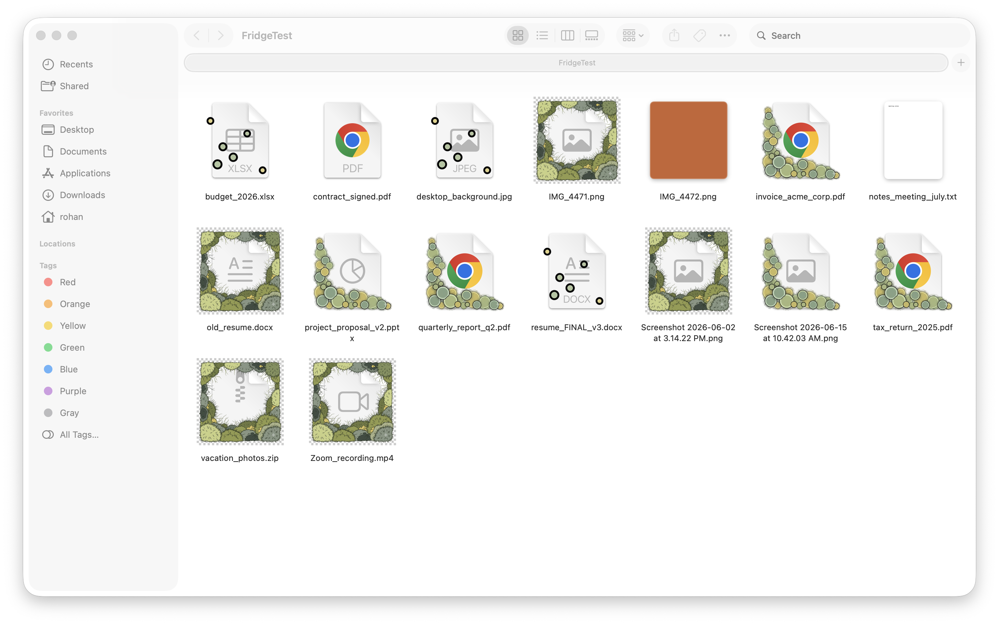

# Fridge

Files you ignore in Downloads and Desktop grow mold on their icons, right in Finder, until you deal with them.





**How it works:** a background watcher checks how long since each file was last opened. The longer it's been, the worse the icon gets, in four stages — fresh, spotty, moldy, fuzzy. Open the window to see everything grouped by freshness, with each file's real current icon, and buttons to reveal it in Finder, freeze it so it stops rotting, or toss it to the Trash.

---

## Status

Built and verified on a real Mac. See `UNCERTAINTIES.md` for the original blind assumptions and what testing actually found, and `DECISIONS.md` for the significant design change made along the way (the UI was originally a menu bar icon; it's a window now, after the status item never rendered on screen for reasons that were never resolved).

## Building it

Open `Fridge.xcodeproj` in Xcode and build (⌘B), or:

```
xcodebuild -scheme Fridge -configuration Debug build
```

No signing certificate required — it builds and runs ad-hoc signed.

## Full Disk Access

Painting a moldy icon means writing to the file, which macOS only allows with Full Disk Access, and won't prompt for on its own. On first launch, Fridge actually attempts the write (to a throwaway file in Desktop) and checks whether it really worked, rather than guessing — if it failed, it shows a panel with a button straight to System Settings > Privacy & Security > Full Disk Access.

Because the app is ad-hoc signed, Xcode assigns a new signature on every rebuild, and macOS ties the Full Disk Access grant to that exact signature — so this needs re-granting after each rebuild during development. Expected, not a bug.

## If something goes wrong: Unmold All

**Unmold All**, at the bottom of the window, strips the custom icon from every file Fridge knows about and restores each one's original icon — confirmed byte-for-byte identical to the original in testing. The emergency undo.

## What's tracked right now

The Watcher points at `~/FridgeTest`, a junk folder used for development — not the real Downloads/Desktop. A real Downloads folder can easily hold 5,000+ files, and pointing the current implementation at one was tried and reverted after it revealed a real risk (see `DECISIONS.md`): an interrupted first scan can leave real files repainted with no ledger record, because the Ledger's clean-icon storage doesn't scale to that size yet. Real folders become available once that's fixed properly.
